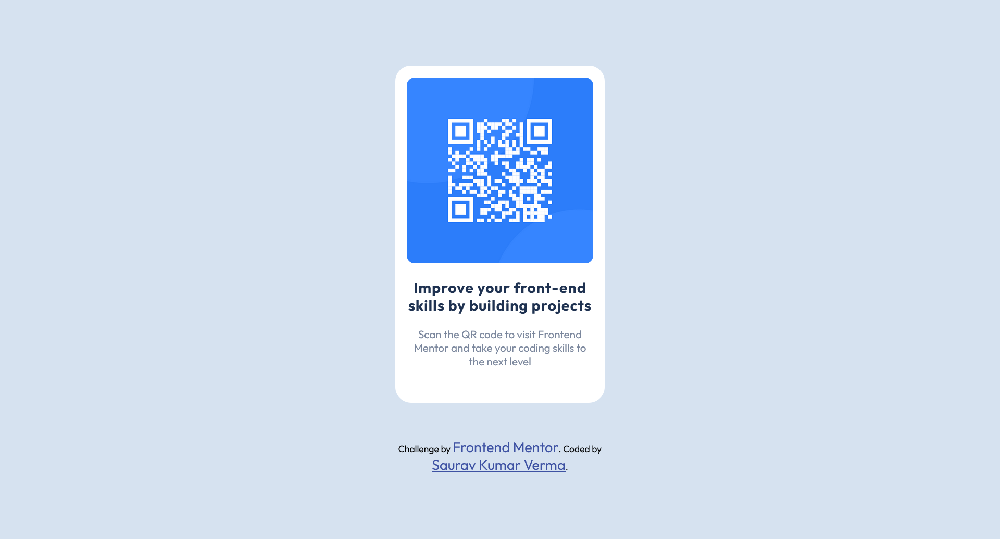
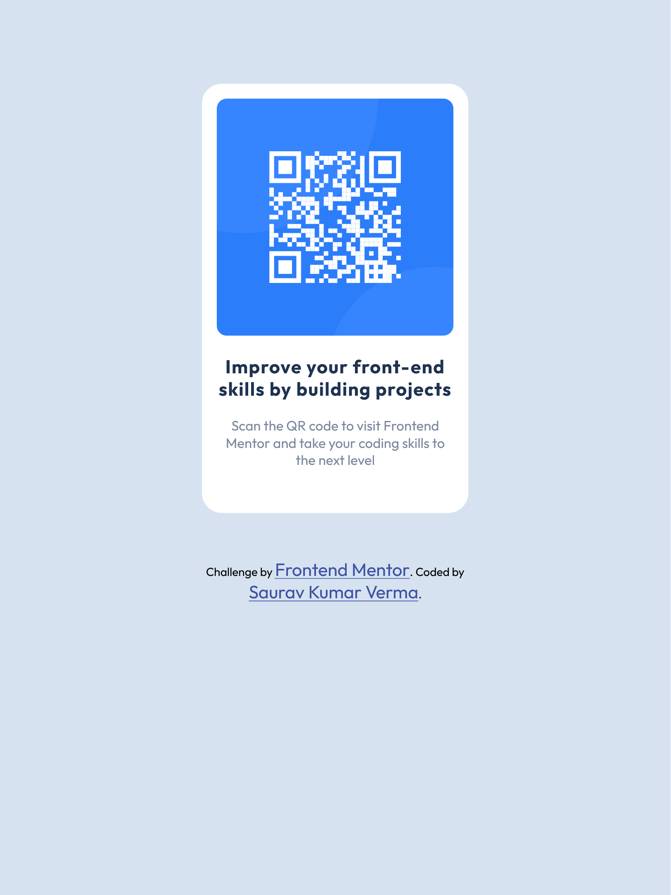

# Frontend Mentor - QR code component solution

This is a solution to the [QR code component challenge on Frontend Mentor](https://www.frontendmentor.io/challenges/qr-code-component-iux_sIO_H). Frontend Mentor challenges help you improve your coding skills by building realistic projects.

## Table of contents

- [Frontend Mentor - QR code component solution](#frontend-mentor---qr-code-component-solution)
  - [Table of contents](#table-of-contents)
  - [Overview](#overview)
    - [Screenshot](#screenshot)
    - [Links](#links)
  - [My process](#my-process)
    - [Built with](#built-with)
    - [What I learned](#what-i-learned)
  - [Author](#author)

## Overview

Frontend Mentor - QR code component coded in HTML & CSS.

### Screenshot

### Links

- Solution URL: [Add solution URL here](https://github.com/Saurav-98/FM_QR-code-component)
- Live Site URL: [Add live site URL here](https://saurav-qr-component.netlify.app)

## My process

1 - Tried to recreate the design using Figma, It helped in getting the css property values such as ( padding, margin, border-radius, font size etc. ) and getting the plan ready for HTML Markup.
2 - Wrote HTML structure based on the figma design created.
3 - Added custom CSS properties and values with the help of Figma to get the desired result.

### Built with

- Semantic HTML5 markup
- CSS custom properties
- Mobile-first workflow

### What I learned

This is one of the beginners challenge from Frontend mentor which was easily created using simple HTML and CSS, I learned to use Figma Tool for taking designing desicions and identifying spacing values.

## Author

- Github - [Saurav-98](https://github.com/Saurav-98)
- Frontend Mentor - [@ySaurav-98](https://www.frontendmentor.io/profile/Saurav-98)
- Linkedin - [Saurav Kumar Verma](https://www.linkedin.com/in/skv22/)
- Twitter - [@SauravKverma22](https://twitter.com/SauravKverma22)
